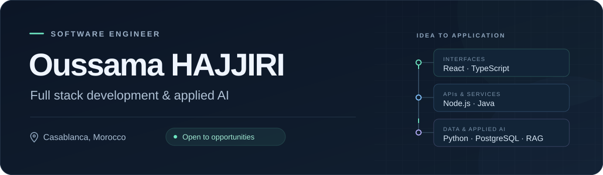

  

  

    <a href="https://hajjiri-oussama.vercel.app/"><strong>Explore my portfolio ↗</strong></a>
    &nbsp;&nbsp;·&nbsp;&nbsp;
    <a href="mailto:hajjirioussama111@gmail.com"><strong>Get in touch ↗</strong></a>
    &nbsp;&nbsp;·&nbsp;&nbsp;
    <a href="#selected-work"><strong>Selected work ↓</strong></a>
  

# Hi, I'm Oussama HAJJIRI

I'm a software engineer based in **Casablanca, Morocco**. I build web applications with **React, TypeScript and Node.js**, develop backend projects with **Java and Spring Boot**, and work on practical applications of **Python and generative AI**.

I like understanding a problem before changing the code. My projects have taught me to take responsibility for the whole application, from its first screens to its data model and access controls. I also enjoy learning from other developers through code reviews and open discussion.

**Open to software engineering opportunities and collaboration.**

## Selected work

### Face.in

**Attendance management through facial recognition.** Built independently during my final year internship at **AKKODIS**, from architecture to production, and deployed for **22 users**.

* Developed a real time dashboard and permissions for **four user roles** in a multi tenant application.
* Integrated **Azure AD authentication** and **PostgreSQL Row Level Security** policies.
* Identified and fixed a privilege escalation vulnerability in the invitation flow.

`React` `TypeScript` `Supabase` `PostgreSQL` `Deno Edge Functions` `face-api.js`

### FromScratch.ai

**From an idea to a first project plan.** An application that generates draft requirements, architecture proposals, user stories and cost estimates. I orchestrated multiple AI agents to produce these structured deliverables.

`Next.js` `Python` `FastAPI` `LangChain` `AutoGen`

### Document Analyzer

**Questions answered with context from documents.** A RAG application that extracts and vectorizes document content, retrieves relevant passages and uses them to support its answers.

`Python` `LangChain` `pgvector`

<strong>More projects: access control and Java microservices</strong>

### ENTRIX

A full stack access control system combining RFID access, remote check in, role based permissions and real time event monitoring.

`React` `Node.js` `PostgreSQL` `WebSocket`

### Student Management System

A Java microservices project covering students, teachers, academic programs and classes, with centralized security and database persistence.

`Java` `Spring Boot` `Spring Cloud` `Spring Security` `JPA` `MySQL` `Docker`

## My toolbox

| Area | Technologies |
| :--- | :--- |
| **Languages** | JavaScript, TypeScript, Java, Python, SQL, C, HTML, CSS |
| **Frontend** | React, Next.js, Angular, Vite, Tailwind CSS, shadcn/ui |
| **Backend & APIs** | Node.js, Express, NestJS, Koa.js, FastAPI, REST APIs, WebSocket |
| **Java ecosystem** | Spring Boot, Spring Cloud, Spring Security, Spring MVC, JPA |
| **Data** | PostgreSQL, MySQL, MongoDB, Oracle, Supabase, pgvector |
| **Applied AI** | LangChain, AutoGen, RAG, agent orchestration, document extraction, vectorization, context retrieval |
| **Security** | OAuth 2.0, Azure AD, JWT, role based access control, PostgreSQL RLS |
| **Delivery & teamwork** | Git, GitHub, Docker, Docker Compose, Vercel, Agile teamwork, code reviews |

<strong>Mobile, IoT and other tools I've worked with</strong>

* **Mobile:** Flutter, Android Studio.
* **IoT:** ESP32, Arduino IDE, Node-RED.
* **Design:** Figma, Photoshop, Illustrator.
* **Other tools:** Streamlit, VMware.

## Experience

**AKKODIS · Software Engineering Intern**  
February 2026 to August 2026 · Final year project  
Designed, developed and deployed Face.in independently.

**TYTHON · Software Engineering Intern**  
March 2025 to June 2025  
Implemented access controls and resolved application defects within an Agile team using Git and code reviews.

**TWICE BOX · Full Stack Developer**  
May 2024 to July 2024  
Built a patient management application used by **more than 50 users** and deployed it with Docker. Stack: React, Node.js, Koa.js and MongoDB.

## Education & languages

**Engineering Degree in Computer Science**  
Université Mundiapolis, Casablanca · 2024 to 2026 · Graduated in July 2026.

**Bachelor's Degree in Applied Computer Science**  
Université Mundiapolis, Casablanca · 2021 to 2024.

Earlier studies

Studies in Economics and Management, Université Sultan Moulay Slimane, Khouribga · 2017 to 2020.

**Arabic:** Native &nbsp;·&nbsp; **French:** Fluent &nbsp;·&nbsp; **English:** B2, EF SET 58/100.

## Beyond the keyboard

Basketball, tennis and photography.

   
  
   
  <strong>Have a project or an opportunity in mind?</strong>
   
  <a href="mailto:hajjirioussama111@gmail.com">hajjirioussama111@gmail.com</a>

